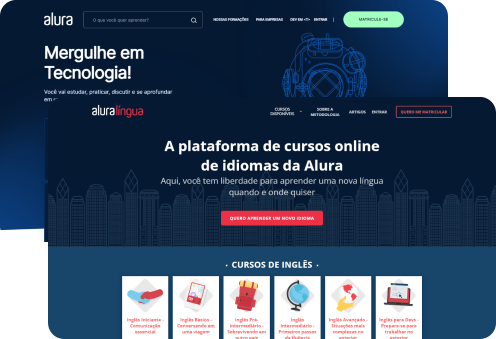

# 🚀 Alura Plus
[](https://pauloswimming.github.io/Alura_plus/)

<p align="center">
  
</p>

## 🌟 Descrição do Projeto

Este projeto é um *landing page* desenvolvido como parte do curso da Alura, focado em HTML e CSS, para simular a página de um serviço de streaming de conteúdo, o **Alura Plus**. O objetivo principal foi aplicar conceitos de _layout_ responsivo, Flexbox e estrutura semântica de código.

## 💻 Tecnologias Utilizadas

| Tecnologia | Versão | Descrição |
| :---: | :---: | :--- |
| **HTML5** | - | Estrutura e semântica do conteúdo. |
| **CSS3** | - | Estilização, layout e responsividade. |

## 💡 Demonstração do Código

Para mostrar como o projeto foi estruturado, seguem o código HTML completo e um trecho do CSS.

### 📄 HTML Completo (`index.html`)

Este é o código da estrutura completa da sua página:

```html
<!DOCTYPE html>
<html lang="br">
<head>
    <meta charset="UTF-8">
    <meta name="viewport" content="width=device-width, initial-scale=1.0">
    <title>Document</title>
    <link rel="stylesheet" href="styles.css">
    <link rel="preconnect" href="[https://fonts.googleapis.com](https://fonts.googleapis.com)">
    <link rel="preconnect" href="[https://fonts.gstatic.com](https://fonts.gstatic.com)" crossorigin>
    <link href="[https://fonts.googleapis.com/css2?family=Inter:wght@400;700&display=swap](https://fonts.googleapis.com/css2?family=Inter:wght@400;700&display=swap)" rel="stylesheet">

</head>
<body>
    <section class=" container principal">
        <div class="container_caixa">
        <h1 class="container_titulo">Com o Combo+, você pode aproveitar a Alura+ e o Alura Língua por um preço único.</h1>
        
        <a href="[www.alura.com](https://www.alura.com).br" class="container_botao">Assine por 12x de R$ 120,00*</a>
        <a href="[www.alura.com](https://www.alura.com).br"  class="container_botao botao_secundario">Assinar somente o Alura+</a>
        <p class="container_aviso">O preço pode variar caso a assinatura seja feita em outros planos.</p>
        </div>
    </section>
    <section class="container secundario">
        
        <div class="container_descricao">
                <h2 class="descricao_titulo">
                    Assista do seu jeito
                </h2>
                <p class="descricao_texto">
                    Aproveite a tela grande da TV ou assista no tablet, laptop, celular e outros aparelhos. Nossa seleção de cursos não para de crescer.
                </p>

        </div>

    </section>

    <section class="container secundario">
        <div class="container_descricao">
            <p class="descricao_texto">
                Só o Combo+ oferece Alura+ e Alura Língua juntos para você ter acesso a cursos de diversas áreas da tecnologia e aprender inglês ou espanhol, onde e como quiser.
        
            </p>
            <a href="[www.alura.com](https://www.alura.com).br" class="container_botao secundario_botao">
                Assine o Combo+
            </a>
        </div>
        
    </section>

    <section class="container secundario">
        
        <div class="container_descricao">
            <h2 class="descricao_titulo">
                Baixe seus cursos
            </h2>
            <p class="descricao_texto">
                Baixe e assista quando e onde quiser. Assim, seus favoritos estão sempre com
                você, até mesmo sem internet.
            </p>

        </div>
    </section>

    <section class="dispositivos">
        <h2 class="dispositivos_titulo">
            Disponível nos seus dispositivos favoritos
        </h2>
        <ul class="dispositivos_lista">
            <li>
                
                <h3 class="lista_item">TV</h3>
            </li>

            <li>
                
                <h3 class="lista_item">Computador</h3>
            </li>

            <li>
                
                <h3 class="lista_item">Celular</h3>
            </li>
        </ul>
    </section>
    <footer class="rodape">
        
        <ul class="rodape_lista">
            <li class="lista_link">
                <a href="#">
                    Idioma
                </a>
            </li>

            <li class="lista_link">
                <a href="#">dispositivos compativeis</a>
            </li>

            <li class="lista_link">
                <a href="#"> Contrato de assinatura</a>
            </li>

            <li class="lista_link">
                <a href="#">Politica de privacidade</a>
            </li>

             <li class="lista_link">
                <a href="#">Anuncios personalizados</a>
            </li>

            <li class="lista_link">
            <a href="#">Ajuda</a>

        </ul>
        <p class="rodape_texto">
            ® 2021 Alura, Alura+ e Alura Língua. Todos os direitos reservados. Serviço de assinatura paga. Conteúdo sujeito a disponibilidade.
        </p>
        <p class="rodape_texto">
            Alura+ é um serviço pago, baseado em assinatura e sujeito a termos e condições. O serviço Alura+ é comercializado por Aovs Sistemas de Informática S.A., Rua Vergueiro, 3185 - Liberdade, São Paulo - SP, 04101-300, Brasil e CNPJ 05.555.382/0001-33
        </p>
    </footer>
</body>
</html>
